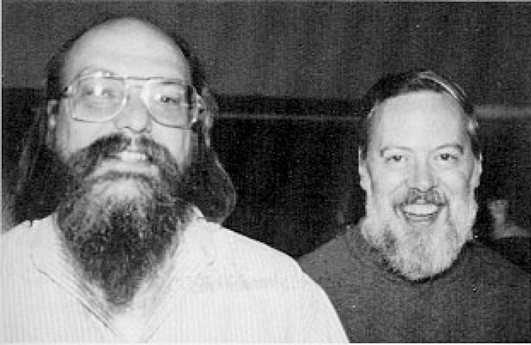
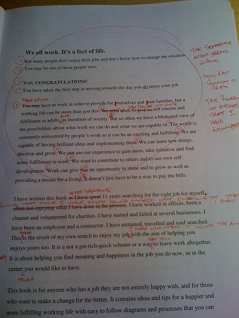
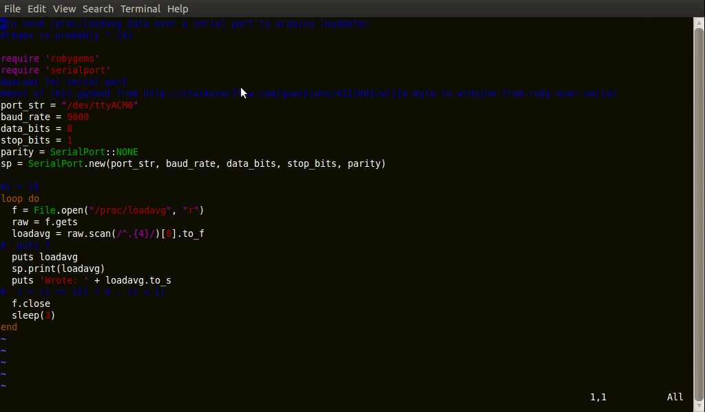

!SLIDE full-page

!SLIDE
## Programmers themselves use version control because programming is a very inexact science. There's a lot of trial and error, and a lot of collaboration, and a need to examine the history of code very very carefully to determine where things broke ##

!SLIDE bullets incremental
## any programmer who tells you they don't need version control is ##
* ...either an absolute genius
* ...lying
* ...working on extremely tiny programs
* ...not really programming, but copying code and telling you they're programming
* ...awful.

!SLIDE full-page

!SLIDE

