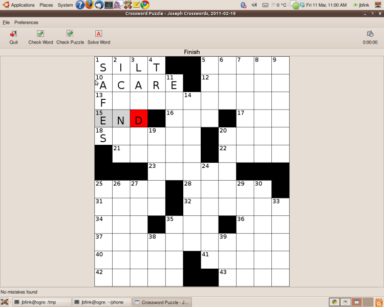

!SLIDE smbullets incremental transition=fade
## What version control is good on ##

* text
* things which require iterative development...
* ...and whose histories you might want to revisit 
* collaboration, but also solo work.

!SLIDE bullets incremental transition=fade 
## what version control is bad on ##

* binaries
* your learning curve

!SLIDE full-page

!SLIDE full-page

!SLIDE full-page

!SLIDE full-page

!SLIDE

!SLIDE
.notes diff
